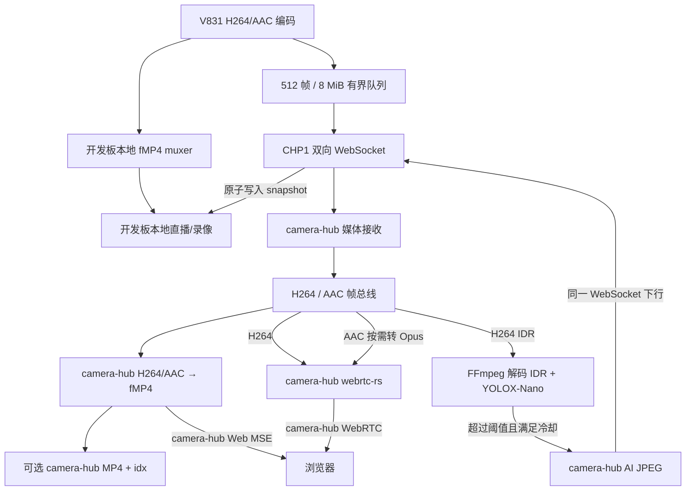

# camera-hub

`camera-hub` 是跨平台 Rust 媒体处理服务，可运行在普通 Linux、LinuxDeploy、
Android/Termux 等环境，不绑定特定手机或设备型号。它接收采集端上传的 H264/AAC，
负责录像、实时分发、可选 ONNX AI 和图片回传；开发板 Web 仍是日常控制入口。

## 当前能力

- 使用一条无 Token 持久 WebSocket 承载 H264、AAC、设备状态和 AI JPEG 回传。
- 开发板只上传 H264 Access Unit 和 AAC ADTS，不上传 Opus 或 fMP4。
- 当前节点将 H264/AAC 零转码封装为 fMP4，供录像、`.idx` 和 fMP4/MSE 直播。
- 仅在 WebRTC 会话存在时启动 AAC→Opus，关闭会话后立即释放转码进程。
- H264 IDR 可直接供 ONNX AI 解码推理，抓拍绘制 person 框后回传开发板。
- 录像、AI、MSE、WebRTC 和 MoQ 使用相互隔离的消费队列。
- Web 提供主机状态、实时直播、协议评测、录像回放、AI 相册和节点设置。
- MoQ 使用同进程 MoqService，以 MSF Draft-01 Catalog 和 LOC Draft-04 逐帧发布
  H264/AAC；浏览器通过 UDP/443 WebTransport + WebCodecs 播放，不增加独立 relay。
- 裸公网 IPv6 使用 Let’s Encrypt shortlived IP 证书直接获得浏览器信任并自动续期。
- 核心默认监听标准端口 80/443；Termux 等无 Root 适配器覆盖为 8080/8443。

camera-hub 不代理开发板硬件控制。以下能力仍由开发板执行：

- 本地 AWNN AI、VMD 和移动侦测拍照。
- 手动拍照、开发板相册、补光灯、OSD、MQTT 和动作按钮。
- 浏览器到开发板扬声器的语音对讲。
- 浏览器与开发板直接建立的 WebRTC 会话。

## 整体架构

camera-hub 页面由 camera-hub 自身提供，展示 camera-hub 的服务状态、实时流、AI 相册、配置和录像。
开发板页面由开发板自身提供，不经过 camera-hub 代理。

```mermaid
flowchart LR
    B[浏览器]
    H[camera-hub<br/>通用计算节点]
    C[V831 开发板<br/>camera-rust]
    D[(camera-hub data)]
    A[ONNX Runtime<br/>YOLOX-Nano]

    B -->|HTTP(S)<br/>Web / API| H
    B -->|节点状态/配置/录像回放/AI 相册| H
    B <-->|MSE / WebRTC 实时流| H
    B -->|开发板 Web/配置/相册| C
    B <-->|MSE / WebRTC<br/>声音/日志/对讲| C

    C -->|无 Token 持久 WebSocket<br/>H264 + AAC + 状态| H
    H -->|AI JPEG| C
    H -->|实时广播同一 fragment| B
    H -->|MP4 + idx| D
    H -->|H264 IDR 直接解码| A
    A -->|Person 事件/抓拍| D
    C -->|AI JPEG 写入本地 snapshot| C
    B -->|远端录像回放| H
    H --> D
```

### 数据面



上传队列与开发板本地采集、直播、录像隔离。camera-hub 网络异常时允许丢弃旧帧，不会
阻塞编码回调。上行只有 H264/AAC；camera-hub 使用 FFmpeg `delay_moov` 和
`aac_adtstoasc` 零转码生成 fMP4，视频 timescale 固定为 90000。Opus 仅在
camera-hub WebRTC 会话期间按需生成。

### 连接行为

开发板配置非空 camera-hub URL 后即持续建立 WebSocket 并上传，不再提供处理模式、
功能开关或旧 HTTP 回退。断线时每秒重连，帧队列最多保留 512 项或 8 MiB，允许
丢弃旧数据但不阻塞本地采集、直播和录像。开发板本地 AI/VMD/录像只遵循各自配置，
不再因 camera-hub 连接状态自动切换。

### 控制面

| 功能 | 浏览器请求目标 | 实际执行位置 |
|---|---|---|
| camera-hub 页面、状态与配置 | camera-hub | camera-hub |
| camera-hub 录像、ONNX AI、AI 照片 | camera-hub 本地 API | camera-hub |
| camera-hub fMP4/MSE 直播（流畅兼容） | 浏览器连接 camera-hub | camera-hub 从 H264/AAC 生成 fMP4 |
| camera-hub HTTP-FLV 直播（TCP 对照） | 浏览器连接 camera-hub | Rust 原生 FLV mux，mpegts.js 播放 |
| camera-hub WebRTC 直播（低延时） | 浏览器连接 camera-hub | H264 直送，AAC 按需转 Opus |
| 四协议并行评测 | 浏览器连接 camera-hub | 同步启动 MSE、HTTP-FLV、WebRTC、MoQ 并统计真实渲染指标 |
| 开发板 Web、配置、相册与硬件控制 | 浏览器直连 | 开发板 |
| MSE、声音、日志、对讲 | 浏览器直连 | 开发板 |
| 开发板 WebRTC 音视频 | 浏览器直连 | 开发板 |

### WebRTC 路径

开发板 Web 的 WebRTC 直播直接执行：

```text
浏览器 ↔ 开发板 /api/webrtc/offer ↔ 开发板 webrtc-rs
```

camera-hub Web 的 WebRTC 直播执行：

```text
V831 H264/AAC → CHP1 WebSocket → camera-hub AAC→Opus → webrtc-rs → 浏览器
```

浏览器通过 `POST /api/v1/devices/:id/webrtc/offer` 与 camera-hub 交换 SDP，之后使用
IPv6 ICE/DTLS/SRTP 直连 camera-hub。该路径不等待 fMP4 fragment，fMP4/MSE 直播则继续使用
fMP4/MSE。

### CHP1 设备链路

```text
GET /api/v1/devices/:id/link
Upgrade: websocket
```

该入口不校验 Token。媒体上行使用 CHP1 v2 的 32 字节网络序头：

```text
magic "CHP1" | kind u8 | version u8 | flags u16
sequence u32 | pts_us i64 | payload_length u32
capture_epoch_us i64 | payload
```

`pts_us` 是音视频同步使用的单调媒体时间；`capture_epoch_us` 是采集端收到编码完成
回调时的 UTC 微秒，用于端到端延迟评测。camera-hub 仍兼容无
`capture_epoch_us` 的 CHP1 v1，v1 会退化为节点接收 UTC。AI JPEG 下行继续使用 v1。

| kind | 方向 | 内容 |
|---|---|---|
| `1` | 开发板 → camera-hub | H264 Access Unit，`flags & 1` 表示关键帧 |
| `2` | 开发板 → camera-hub | AAC ADTS |
| `0x81` | camera-hub → 开发板 | 文件名 + AI JPEG |

文本消息只承载 `hello`。开发板每 10 秒更新固件版本、IPv6 和最后已同步照片；
camera-hub 由此更新设备在线状态并避免重连后重复回传历史 JPEG。

## 运行与数据目录

核心程序不依赖特定设备型号、Linux 发行版或 init 系统。默认使用标准端口 80/443
和当前工作目录下的相对路径；无 Root 平台由部署适配器覆盖监听端口：

| 配置 | 默认值 |
|---|---|
| HTTP | `[::]:80` |
| HTTPS | `[::]:443` |
| 数据目录 | `./camera-hub-data` |
| 运行状态 | `./camera-hub-state` |
| AI 资源 | `./camera-hub-ai`，默认关闭 AI |

生产环境通过 `CAMERA_HUB_` 环境变量覆盖，不需要修改代码：

```bash
CAMERA_HUB_BIND=[::]:80
CAMERA_HUB_TLS_BIND=[::]:443
CAMERA_HUB_TLS_CERT=/srv/camera-hub/state/cert.pem
CAMERA_HUB_TLS_KEY=/srv/camera-hub/state/key.pem
CAMERA_HUB_DATA_DIR=/srv/camera-hub/data
CAMERA_HUB_SETTINGS_FILE=/srv/camera-hub/state/settings.json
CAMERA_HUB_AI_RUNTIME=/srv/camera-hub/ai/lib/libonnxruntime.so
CAMERA_HUB_AI_MODEL=/srv/camera-hub/ai/yolox_nano.onnx
```

Web 可修改的 AI、录像和清理策略保存在 `CAMERA_HUB_SETTINGS_FILE`。监听地址、
证书和文件路径属于部署级配置，始终由命令行或环境变量管理。使用 80/443 时可由
反向代理转发，或在支持 capability 的 Linux 上授予 `CAP_NET_BIND_SERVICE`；
Termux 等无 Root 环境直接使用 8080/8443。

数据目录结构与平台无关：

```text
<data-dir>/
├── <device_id>/
│   ├── record/
│   │   └── YYYYMMDD/
│   │       ├── YYYYMMDD_HHMMSS.mp4
│   │       └── YYYYMMDD_HHMMSS.mp4.idx
│   └── snapshot/
│       └── YYYYMMDD/
│           └── YYYYMMDD_HHMMSS_NNN.jpg
```

数据目录应保持私有，不要放入允许匿名列目录或写入的文件服务根目录。

## API

当前设备接口：

```text
GET  /api/v1/devices/:id/link
```

以下 Web/Viewer 接口不需要鉴权，可直接访问：

```text
GET  /api/v1/devices
GET  /api/v1/media/status
GET  /api/v1/settings
PUT  /api/v1/settings
GET  /api/v1/ai/status
GET  /api/v1/system/status
GET  /api/v1/moq/status
GET  /api/v1/devices/:id/live              # WebSocket fMP4 实时流
GET  /api/v1/devices/:id/live.flv          # HTTP chunked FLV 实时流
POST /api/v1/devices/:id/webrtc/offer      # camera-hub WebRTC Offer/Answer
DELETE /api/v1/devices/:id/webrtc/offer    # 关闭 camera-hub WebRTC 会话
GET  /api/v1/devices/:id/photos            # camera-hub AI 相册列表
DELETE /api/v1/devices/:id/photos          # 清空该设备在 camera-hub 的 AI 照片
DELETE /api/v1/devices/:id/photos/:name    # 删除单张 camera-hub AI 照片
GET  /api/v1/devices/:id/records/days
GET  /api/v1/devices/:id/records/:date
GET  /photos/:id/:name                     # camera-hub AI 原图
GET  /certificate.sha256                   # MoQ 开发证书 SHA-256 pin
GET  /.well-known/acme-challenge/:token     # ACME HTTP-01
```

camera-hub 录像播放地址为 `GET /records/:id/:date/:name`，支持 HTTP Range。Web 页面和
设备 WebSocket 均不启用鉴权。

## AI 推理

AI 是可选能力，核心媒体接收、录像、MSE 和 WebRTC 不依赖 ONNX Runtime。通用默认
配置关闭 AI；部署节点提供兼容本机 ABI 的 ONNX Runtime 动态库和模型后再启用：

```text
推理框架：ONNX Runtime CPU
Rust 接入：ort crate（运行时动态加载）
检测模型：YOLOX-Nano ONNX，输入 416x416
检测类别：只保留 COCO class 0（person）
解码方式：FFmpeg 直接解码最新 H264 IDR Access Unit
```

`CAMERA_HUB_AI_RUNTIME` 必须指向当前平台可加载的 `libonnxruntime.so`。Linux
AArch64/glibc、Android/Termux Bionic 和其他平台的动态库不能混用。Termux 初次部署
会保持 AI 关闭；媒体和录像可直接运行，AI 运行时单独安装后再从 Web 开启。

```bash
CAMERA_HUB_AI_ENABLED=true
CAMERA_HUB_AI_RUNTIME=/srv/camera-hub/ai/lib/libonnxruntime.so
CAMERA_HUB_AI_MODEL=/srv/camera-hub/ai/yolox_nano.onnx
CAMERA_HUB_AI_INTERVAL_MS=1000
CAMERA_HUB_AI_THRESHOLD=0.30
CAMERA_HUB_AI_MIN_PERSON_AREA_RATIO=0.02
CAMERA_HUB_AI_MIN_SNAPSHOT_SECONDS=10
CAMERA_HUB_AI_SNAPSHOT_MAX_COUNT=500
CAMERA_HUB_AI_SNAPSHOT_QUALITY=95
```

检测照片写入 `<data-dir>/<device_id>/snapshot/YYYYMMDD/`，并经同一设备 WebSocket
回传开发板相册。照片使用推理时的同一帧，按 YOLOX 输出执行 person 框解码和 NMS，
只保留面积达到原图 `CAMERA_HUB_AI_MIN_PERSON_AREA_RATIO` 比例的框，再对抓拍 JPEG
绘制识别框与置信度，不改写直播视频。默认值 `0.02` 表示框面积至少占画面 2%；
Web 设置页使用百分比显示，设为 `0` 可关闭面积过滤。

每台设备的 AI 照片独立执行数量限制，只保留最新
`CAMERA_HUB_AI_SNAPSHOT_MAX_COUNT` 张，默认每设备最多 500 张。修改 Web 设置后
立即清理，成功抓拍后和每小时也会重新检查。`CAMERA_HUB_AI_SNAPSHOT_QUALITY`
使用 1–100 的直观质量值，默认 95 对应原有 FFmpeg JPEG `q:v=3`，因此升级后默认
画质与文件大小不变。

Web AI 相册支持删除单张或清空当前设备照片。删除只作用于 camera-hub 本地
`snapshot` 目录，不会反向删除此前已经同步到开发板相册的副本。

## Web 管理界面

Web 是独立的轻量运维页面，不复制开发板完整控制台，提供运行概览、实时直播、
协议评测、录像回放、AI 相册和节点设置：

- fMP4/MSE 直播使用约 1 秒 fMP4 fragment + MSE，偏向流畅性和浏览器兼容性。
- HTTP-FLV 直播使用 Rust 原生 FLV mux 与 `mpegts.js`，作为 TCP 直播对照链路。
- WebRTC 直播使用 `webrtc-rs`，H264 直送且 AAC 按需转为 Opus，偏向低延时。
- 协议评测同步启动 MSE、HTTP-FLV、WebRTC 和 MoQ，停止时统一释放四路会话。
- 展示当前主机 CPU、负载、内存、进程 RSS、数据盘和服务运行时长。
- 管理 ONNX AI、录像分片、保留天数和容量上限。
- 录像支持 MSE、`.idx`、HTTP Range 和 24 小时总时间轴。
- AI 相册读取当前 camera-hub 节点保存的检测抓拍。

### 协议评测口径

- 首帧出图：点击开始到第一帧进入浏览器合成器；MoQ 以 Canvas 完成绘制为准。
- 编码后端到端延迟：采集端 H264 编码完成 UTC 到浏览器实际渲染 UTC；不包含
  传感器曝光、ISP 和 H264 编码耗时。
- 卡顿分级：相邻视频渲染帧间隔分别超过 100/250/500 ms 时，记为微卡顿、
  可感知卡顿和严重卡顿。
- 额外卡顿时长：超阈值帧间隔扣除 30fps 正常帧周期，页面隐藏期间不统计。

MSE、HTTP-FLV 和 WebRTC 使用 `requestVideoFrameCallback`；MoQ 在
`@moq/watch` Canvas 的 `drawImage` 完成后发送帧事件。媒体时间通过各协议首个实时
IDR 锚点映射回 FrameHub，MoQ/LOC 直接使用源 PTS。浏览器时钟通过评测状态 API 的
最小 RTT 样本校准到 camera-hub；CHP1 v2 使用类似 NTP 的四时间戳双向交换校准
开发板与 camera-hub 的时钟偏差，不会将单向网络时延误计为时钟差。CHP1 v1 只能
统计 camera-hub 接收到浏览器渲染的估算延迟。

FrameHub 会在源 AAC 与 H264 时间轴相差超过 100 ms 时，将 AAC 平滑校正到视频时钟
域，避免声卡采样时钟长期漂移影响 MoQ 的音视频同步。

这里不把 H264 SEI 作为统一测量入口，因为浏览器的 MSE、HTTP-FLV 和 WebRTC
解码后渲染 API 无法读取压缩码流 SEI；CHP1 v2 可以同时覆盖四条播放路径。

### Web 源码与生成目录

- `web-src/` 是唯一源码目录，包含 `static/` 手写资源、TypeScript 播放器和 npm 配置。
- `web/` 由 `cd web-src && npm run build` 完整生成，并由 Rust `include_str!` 嵌入。
- 生成结果保留在仓库中，使目标设备构建 Rust 时不需要安装 Node.js。

开发时只修改 `web-src/`，不要直接修改 `web/`。详细约定见
[web-src/README.md](web-src/README.md)。

标准访问地址：

```text
http://[hub-ipv6]/
https://[hub-ipv6]/
```

Termux 等无 Root 平台由适配器覆盖为 8080/8443。HTTPS 使用自签名证书时，浏览器首次访问需要确认；
生产环境建议使用可信域名证书。

## 部署适配器

核心程序保持平台无关，`deploy/` 只保存各平台的安装和自启动策略：

| 环境 | 入口 | 默认端口 | 自启动 |
|---|---|---|---|
| 普通 Linux | 手工环境变量或自建 systemd | 80/443 | 由发行版管理 |
| LinuxDeploy 参考设备 | `deploy/linuxdeploy/` | 80/443 | `rc.local` |
| 无 Root Android/Termux | `deploy/termux/` | 8080/8443 | Termux:Boot |

### 通用 Linux

```bash
cargo build --release
CAMERA_HUB_DATA_DIR=/srv/camera-hub/data ./target/release/camera-hub
```

程序运行时需要 FFmpeg；启用 AI 时还需要与当前系统 ABI 匹配的 ONNX Runtime。

### LinuxDeploy 参考设备

LinuxDeploy 参考适配器位于 `deploy/linuxdeploy`，完整安装和 DNSPod DDNS 配置见
[LinuxDeploy 部署](deploy/linuxdeploy/README.md)。连接参数使用通用名称：

只将当前源码同步到目标节点，不构建或重启：

```bash
bash deploy/linuxdeploy/deploy.sh sync
```

目标地址变化时可临时覆盖连接参数：

```bash
HUB_HOST=其他主机名 HUB_USER=android \
    bash deploy/linuxdeploy/deploy.sh sync
```

完整构建、安装并重启服务：

```bash
HUB_HOST=mi6.gwghome.site HUB_USER=android HUB_PASSWORD=... \
    bash deploy/linuxdeploy/deploy.sh push
```

该适配器负责 `/home/android` 路径、80/443 capability、ONNX 资源和 `rc.local`，
这些都不是 camera-hub 核心程序的硬依赖。

LinuxDeploy 适配器还可代资源受限边缘节点管理权威证书。
`camera-hub-acme-edge` 从设备状态 API 获取指定设备的公网 IPv6，使用 Let’s
Encrypt short-lived IP 证书，通过 SSH 同步 HTTP-01 challenge 和最终证书，并重启
当前活动的 Camera C++/Rust 版本。默认关闭；Camera 部署脚本安装专用公钥后启用：

```text
CAMERA_HUB_EDGE_ACME_ENABLED=true
CAMERA_HUB_EDGE_DEVICE_ID=v831cam
CAMERA_HUB_EDGE_SSH_USER=root
CAMERA_HUB_EDGE_SSH_KEY=/home/android/.ssh/camera-hub-edge-acme-rsa
CAMERA_HUB_EDGE_RUNTIME_DIR=/root/maix_dist
```

边缘节点私钥只通过 SSH 下发，不经过无 Token 的媒体 WebSocket。

#### DNSPod 多设备 DDNS

LinuxDeploy 适配器同时安装独立进程 `camera-hub-ddns`。它从指定网卡选择稳定的
公网 `/64` IPv6 地址，保留每台设备配置的后 64 位，并对账 DNSPod 中已存在的
默认线路 AAAA 记录。临时、deprecated、tentative 和 DAD 失败地址不会被选中。

配置文件为 `/home/android/.config/camera-hub-ddns.env`，归属
`android:android`，权限固定为 `0600`。安装后默认
`CAMERA_HUB_DDNS_ENABLED='false'`，不会启动进程，也不会访问 DNSPod。

先在 Mi6 上验证地址合成：

```bash
bash deploy/linuxdeploy/deploy.sh ddns-dry-run
```

预期管理以下记录：

```text
gwghome.site         = 当前 /64 + 528f:4cff:feef:dd90
mi6.gwghome.site     = 当前 /64 + 528f:4cff:feef:dd90
v831.gwghome.site    = 当前 /64 + a22c:36ff:febd:4feb
lecoo.gwghome.site   = 当前 /64 + 8647:09ff:fe45:35a0
lecoo-wifi.gwghome.site = 当前 /64 + 72c9:12ff:fe1c:2f67
huawei.gwghome.site  = 当前 /64 + 1a56:80ff:fe82:816a
```

确认结果后，在腾讯云创建只用于 DNSPod 的 CAM API 密钥，将
`CAMERA_HUB_DDNS_SECRET_ID`、`CAMERA_HUB_DDNS_SECRET_KEY` 写入配置，并把
`CAMERA_HUB_DDNS_ENABLED` 改为 `true`。先执行一次前台对账，再启动常驻进程：

```bash
bash deploy/linuxdeploy/deploy.sh ddns-once
bash deploy/linuxdeploy/deploy.sh ddns-start
```

常驻进程每 60 秒检查本机前缀，前缀变化时更新所有目标记录；即使前缀未变，也会
每 6 小时强制与 DNSPod 对账。它只修改已存在且唯一的默认线路 AAAA 记录，不会
自动创建记录；查询失败或发现重复记录时不会写入状态文件。

### Termux

无 Root 手机可直接部署，详见 [Termux 部署](deploy/termux/README.md)：

```bash
pkg install rust clang ffmpeg openssl-tool procps curl git pkg-config
./deploy/termux/install.sh
```

Termux 使用 Android Bionic ABI，不能复用 LinuxDeploy 的 glibc 二进制。安装器默认
关闭 AI，但媒体接收、录像、MSE、HTTP-FLV 和 WebRTC 可以独立运行。

## HTTP-FLV 直播

HTTP-FLV 由 Rust 直接将 FrameHub 中的 H264 Annex-B 转为 AVC FLV Tag，并将 AAC
ADTS 转为 AAC Sequence Header 与 Raw Tag。输出经同源 HTTP chunked response
发送给浏览器，再由本地打包的 `mpegts.js` 转为 MSE 播放。每个会话等待下一帧
实时 IDR 起播，发生积压后重新等待 IDR；全局最多 4 路，客户端断开后异步任务
自动退出。该路径不启动 FFmpeg 子进程，也不执行流探测，主要用于与
MSE/WebSocket、WebRTC 和 MoQ 做 TCP 网损对比。

## MoQ 低延时直播

MoQ 默认发布 `<device-id>.msf`，其中 `catalog` 使用 MSF Draft-01，`video` 和
`audio` Track 使用 LOC Draft-04。服务端直接使用 `moq-msf` 和 `moq-loc`，不发布
Hang `catalog.json` 兼容入口。方案选型和后续 IETF MoQT wire protocol 互操作计划
见 [MoQ 设计](docs/moq.md)。当前仍作为与 WebRTC 同级的实验直播模式。
